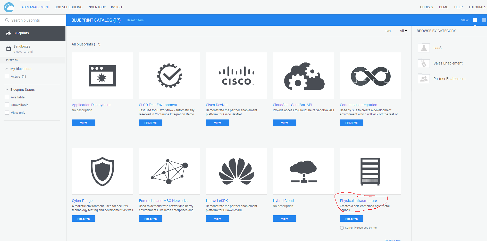
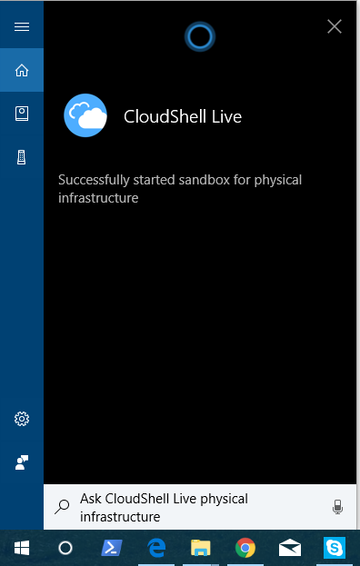
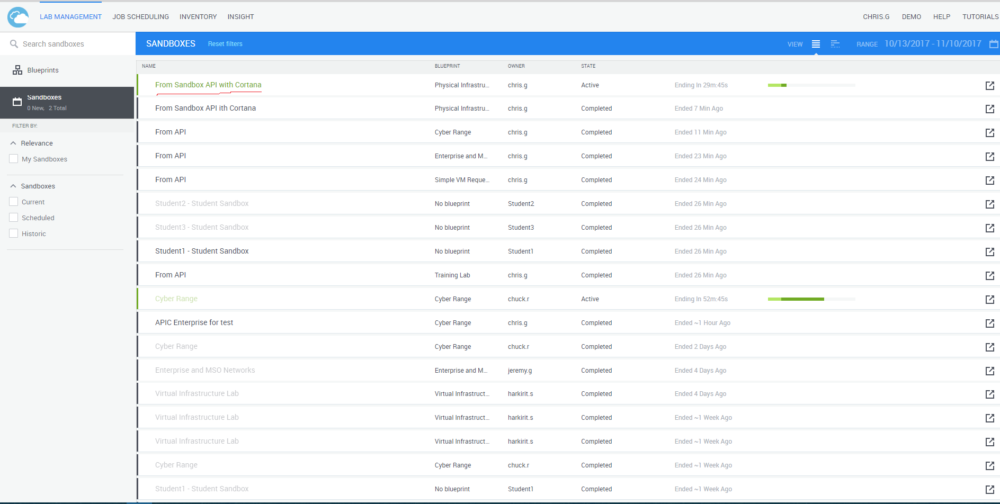

# CloudShell Skill
## Background
This is a simple proof-of-concept bot that also works as a Cortana Skill. It uses the CloudShell Sandbox API to start sandboxes.

## Screenshots
Find the name of the Blueprint you want to use:

Tell Cortana:

Sandbox starts!

## Notice
This is currently a proof-of-concept and does not prompt for authentication. Thus, it is not in the public marketplace yet. Once those features are added, it may be public.